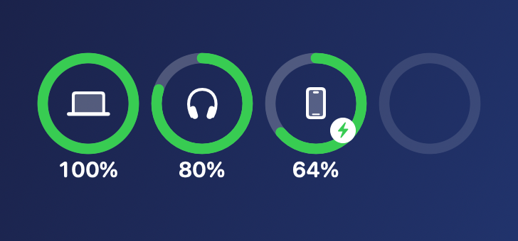
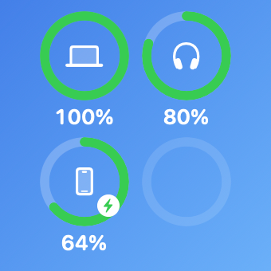

# Phone Battery on macOS

Show an Android phone's battery on a Mac — in the **menu bar**, as a **desktop
card**, and as a real **WidgetKit widget** — over **Bluetooth only**.

No shared Wi‑Fi. No cloud account. No companion service. No Gradle.

<p align="center">
  
  
</p>

---

## Why this needs custom code

Three facts make the obvious approaches fail:

1. **A phone never advertises its own battery over Bluetooth.** Battery-over-Bluetooth
   is a *peripheral* feature. Headsets, mice and keyboards implement the standard
   GATT Battery Service (`0x180F` / characteristic `0x2A19`); Android does not
   expose the phone's own battery that way. An app has to do it on the phone.
2. **macOS will not surface a battery for a generic BLE peripheral.** It only
   reports batteries for HID and audio accessories. The trick of serving a HID
   service from the phone to sneak into that path **does not work**: macOS then
   demands a bonded, encrypted link for HID, and because the phone is *already*
   bonded to the Mac the link is dropped immediately after `connect` (measured —
   see `diagnostics/probe.swift`). It also breaks every other central, including
   a plain battery reader.
3. **ADB wireless debugging needs both devices on one WLAN**, which is frequently
   impossible (different networks, client isolation, corporate Wi‑Fi).

So this project does the one thing that does work: **the phone advertises a
standard Battery Service, and a small Mac app reads it directly over BLE.** The
widget is fed by that app.

---

## How it works

```
┌─────────────────────────┐
│ Android app             │  advertises GATT Battery Service 0x180F
│ (foreground service)    │  characteristic 0x2A19 = battery %, notify
└───────────┬─────────────┘
            │  Bluetooth LE
            ▼
┌─────────────────────────┐        ┌──────────────────────────────┐
│ macOS menu bar app      │◀───────│ pmset -g accps               │
│ (CoreBluetooth central) │        │ Mac's own + accessory levels │
└───────────┬─────────────┘        └──────────────────────────────┘
            │ writes JSON (level.json)
            ▼
   ~/Library/Containers/<widget-id>/Data/Library/Application Support/PhoneBattery/
            │
            ▼
┌─────────────────────────┐
│ WidgetKit extension     │  reads the file on each timeline refresh
└─────────────────────────┘
```

The Mac app also draws a draggable desktop card, which — unlike the widget — is
real-time, because it is driven by BLE notifications rather than WidgetKit's
schedule.

---

## Layout

| Path | What |
| --- | --- |
| `android/` | The phone app: `BluetoothGattServer` + `BluetoothLeAdvertiser`, battery-only by design |
| `android/build.sh` | Builds and signs the APK with `aapt2 → javac → d8 → zipalign → apksigner` (no Gradle) |
| `macos/` | The menu bar app, desktop card, and the shared widget view |
| `macos/Widget/` | The WidgetKit extension |
| `macos/render-widget-preview.sh` | Renders the widget design offscreen to PNG — check the look without a screenshot |
| `diagnostics/` | Small Swift tools used to work out the Bluetooth behaviour (see `diagnostics/README.md`) |
| `scripts/setup-toolchains.sh` | Downloads the Android SDK bits |

---

## Requirements

- **macOS 14+** (the widget uses `containerBackground`), Xcode command line tools
- **Android 8.0+** (API 26)
- A **code signing identity** for the widget (see *Signing* below) — an Apple ID
  added in Xcode is enough, no paid developer programme
- JDK **17** for the Android build, and optionally for signing

---

## Build

### Android app

```sh
./scripts/setup-toolchains.sh    # ~250 MB, once
./android/build.sh               # -> android/PhoneBatteryBLE.apk
```

Install it on the phone (sideload), open it, grant the Bluetooth permission. A
persistent notification appears; that is the foreground service advertising the
Battery Service.

### macOS app

```sh
./macos/build-app.sh             # -> macos/PhoneBattery.app
open macos/PhoneBattery.app
```

For the **widget** to be discoverable the app must live in a standard location:

```sh
cp -R macos/PhoneBattery.app /Applications/
/System/Library/Frameworks/CoreServices.framework/Frameworks/LaunchServices.framework/Support/lsregister -f /Applications/PhoneBattery.app
pluginkit -a /Applications/PhoneBattery.app/Contents/PlugIns/PhoneBatteryWidget.appex
```

Then add it from the widget gallery (search **PhoneBattery** — the gallery groups
by app name).

### Signing

`build-app.sh` picks the first `codesign` identity it finds and signs the
extension first, then the app. If there is no identity it falls back to ad-hoc —
**and the widget will then never appear in the gallery**, because macOS requires
a Team ID for widget extensions.

To create an identity: open Xcode → *Settings → Accounts* → `+` → Apple ID, then
*Manage Certificates* → `+` → **Apple Development**.

---

## Hard-won gotchas

Everything below was diagnosed by reading `chronod`'s log, because none of it
produces a user-visible error.

1. **A widget extension must be sandboxed.** Without
   `com.apple.security.app-sandbox`, `pluginkit -a` still returns 0, but the
   extension never registers:
   `pluginkit -m -i <id>` → `(no matches)`.
2. **A widget extension must be signed with a real Team ID.** Ad-hoc signatures
   (`Signature=adhoc`, `TeamIdentifier=not set`) are not listed in the gallery.
3. **It must declare its platform.** `CFBundleSupportedPlatforms=[MacOSX]` plus
   `DTPlatformName` / `DTSDKName`. `swiftc` does not inject these; Xcode does.
4. **It must link `_NSExtensionMain`.** App extensions are launched as XPC
   services and entered through it:
   ```sh
   swiftc … -Xlinker -e -Xlinker _NSExtensionMain
   ```
   Without it the binary has a plain Swift `main`, and `chronod` logs
   `query failed … "The connection to service with pid -1 named (null) was invalidated"`
   forever while the gallery stays empty.
5. **`codesign` can fail with `errSecInternalComponent`** if the Apple WWDR
   intermediate matching your certificate's issuer is missing from the keychain.
   Check the issuer and install the right one, e.g.
   `curl -O https://www.apple.com/certificateauthority/AppleWWDRCAG3.cer`,
   then `security import AppleWWDRCAG3.cer -k ~/Library/Keychains/login.keychain-db`.
6. **`chronod` caches descriptors and timestamps the extension as
   `1970-01-01`**, so after a rebuild it keeps serving the *old* design and never
   learns about newly supported widget sizes. Force re-discovery:
   ```sh
   pluginkit -r /Applications/PhoneBattery.app/Contents/PlugIns/PhoneBatteryWidget.appex
   rm -rf ~/Library/Containers/com.dsh.phonebattery.menubar.widget/Data/SystemData/com.apple.chrono
   pluginkit -a /Applications/PhoneBattery.app/Contents/PlugIns/PhoneBatteryWidget.appex
   killall chronod
   ```
7. **A sandboxed widget cannot read your app's files.** An App Group needs a real
   provisioning profile; instead the app writes into the widget's own container,
   which the sandboxed widget reads as its own Application Support directory.
8. **Do not add a HID service to the phone's GATT server.** See *Why* above; it
   kills the connection for everything.
9. **JDK 21 breaks the Android build.** `d8`/R8 8.2.2 in build-tools 34.0.0
   crashes on anonymous inner classes compiled by `javac` 21
   (`NullPointerException: Cannot invoke "String.length()"`). `build.sh` selects
   JDK 17.
10. **Verify from the daemon's log, not the UI:**
    ```sh
    log show --last 5m --predicate 'process == "chronod"' | grep -i phonebattery
    ```
    `Reload success` and `Successfully subscribed to session` mean it is live.

---

## Limitations

- **The widget refreshes on the system's schedule.** The timeline asks for a
  15-minute refresh; macOS coalesces these and will often take longer. Treat the
  widget as a glance, and the menu bar / desktop card as the live readout.
- **The phone's charging state is unknown.** The Bluetooth Battery Service
  carries only a level, so the phone's ring never shows the charging bolt. The
  Mac and accessory rings do.
- **The phone app must stay running.** It holds a foreground service; Android may
  still stop advertising under aggressive battery management. Exempt it from
  battery optimisation if the value goes stale.

---

## License

MIT — see [LICENSE](LICENSE).
